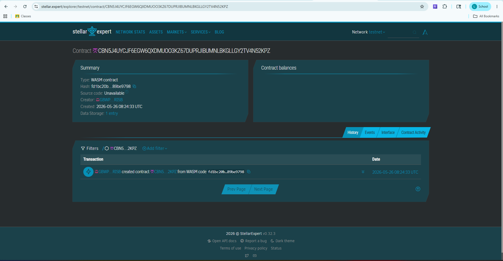

# PalayPay Vault

**One-line description:** An automated treasury contract that guarantees instant, on-chain payments to rice farmers upon crop delivery.

## Problem & Solution
**Problem:** Rice farmers in the Philippines wait up to 30 days for agricultural cooperatives to process physical checks for their harvest, forcing them into predatory loans (like "5-6") to survive until the cash clears.
**Solution:** PalayPay digitizes the cooperative's purchasing fund into a Soroban smart contract. When a farmer delivers their harvest, the warehouse admin logs the weight on-chain, and the contract instantly calculates and transfers the exact PHPC value directly into the farmer's mobile wallet.

## Timeline
Built specifically for the [Stellar Philippines Bootcamp 2026](https://github.com/armlynobinguar/Stellar-Bootcamp-2026).

## Stellar Features Used
* Stellar Testnet
* Soroban Smart Contracts
* Native Token Interface (PHPC / USDC)

## Vision and Purpose
To modernize the agricultural supply chain by eliminating predatory middlemen and administrative delays, ensuring the farmers who feed the country are paid instantly and fairly.

## Prerequisites
* [Rust](https://www.rust-lang.org/tools/install) (with `wasm32-unknown-unknown` target)
* [Stellar CLI](https://developers.stellar.org/docs/tools/stellar-cli)

## How to Build
```bash
cargo build --target wasm32-unknown-unknown --release

## Stellar Expert Link
https://stellar.expert/explorer/testnet/contract/CBN5J4UYCJF6EGW6QXDMUOO3KZ67DUPRJIBUMNLBKGLLGY2TV4N52KPZ

##Contact ID:
CBN5J4UYCJF6EGW6QXDMUOO3KZ67DUPRJIBUMNLBKGLLGY2TV4N52KPZ

##Screenshot


